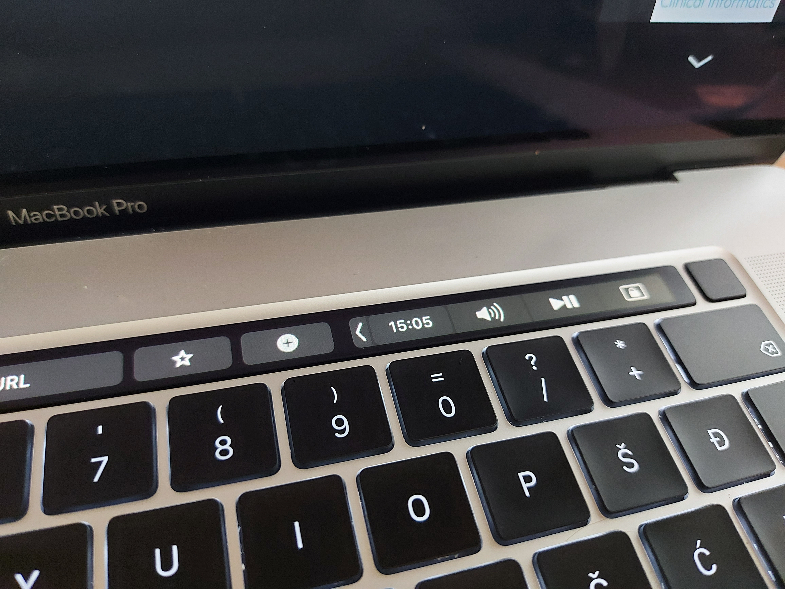

# TouchbarTime - MacOS Touch Bar Control Strip clock

A Touch Bar Control Strip region icon displaying current time.



Uses a private API, not suitable for the App Store.

A fork of https://github.com/liqwid/touchbar_time. Improves on it by restoring the icon every 10 seconds
because otherwise it gets replaced by the system multimedia app selector whenever any supported
multimedia application is started.

## Usage

### Build
```
$ make
```

### Use

- copy the produced touchbar_time.app to your Applications folder
- if you wish, you can make it start on system startup in the Users preferences pane